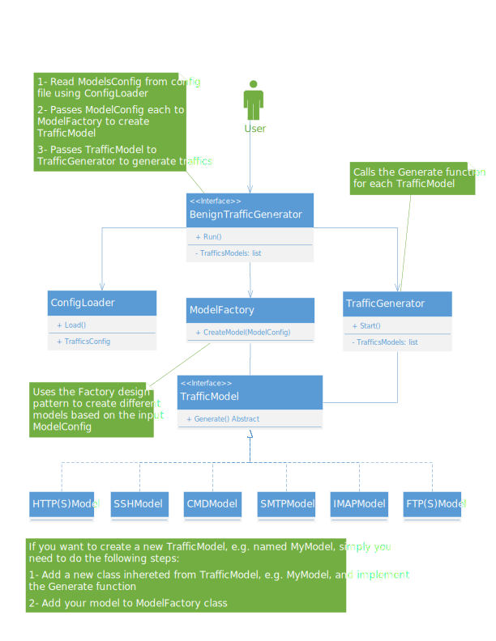

# BenignTrafficGenerator

TODO: update these values:
    


# Table of Contents

- [Installation](#installation)
- [Architecture](#architecture)

# Installation

You must install the requirements in your system before you can begin installing or running anything. To do so, you can easily run this command:

```bash
sudo pip3 install -r requirements.txt
```

You are now ready to install BenignTrafficGenerator. In order to do so, you should run this command, which will install the BenignTrafficGenerator package in your system:

```bash
sudo python3 setup.py install
```

Finally, to execute the program, run this command:

```bash
sudo benign-traffic-generator
```
Also, you can use `-h` to see different options of the program.

Moreover, this project has been successfully tested on Ubuntu 20.04. It should work on other versions of Ubuntu OS (or even Debian OS) as long as your system has the necessary python3 packages (you can see the required packages in the `requirements.txt` file).

# Architecture




                
----
